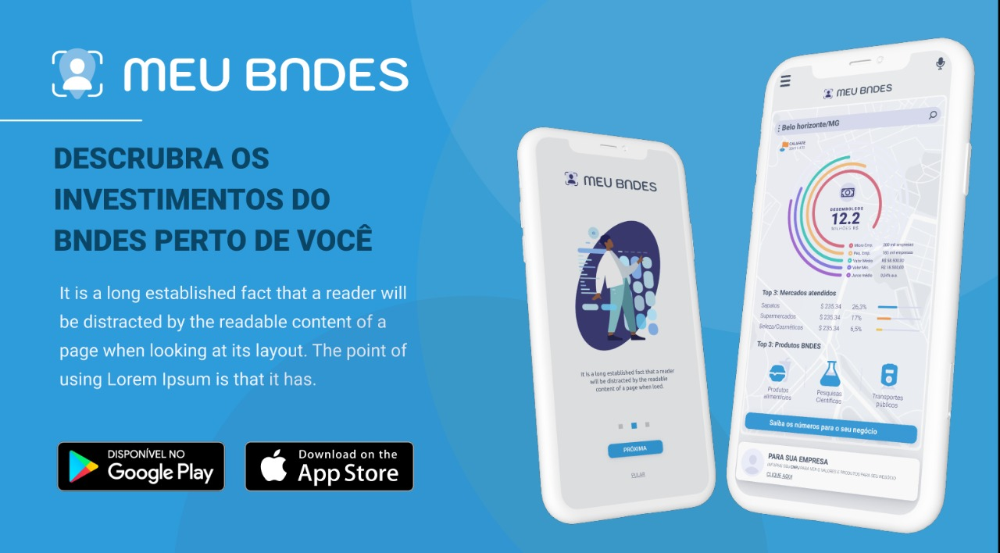
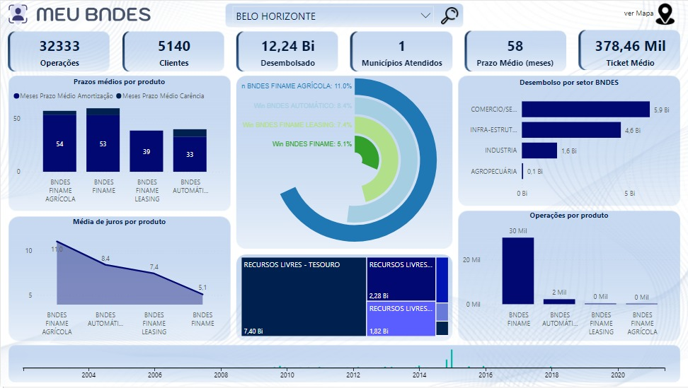

# Meu BNDES

Projeto para o Prêmio Dados Abertos para o Desenvolvimento do BNDES
[Prêmio Dados Abertos para o Desenvolvimento do BNDES](http://www.bndes.gov.br/premiodadosabertos)
O Prêmio Dados Abertos para o Desenvolvimento é uma iniciativa do BNDES para incentivar a colaboração entre governo e sociedade e para estimular o desenvolvimento de estudos, análises e soluções de empreendedorismo tecnológico que contribuam para aprimorar e modernizar a gestão pública. [(saiba mais)](http://www.bndes.gov.br/premiodadosabertos)

Este projeto tem como finalidade comunicar e melhorar a efetividade no apoio do banco na abordagem dos micro e pequenos emprendedores que não conhecem ou que conhecem mas não sabem as possibilidades oferecidas pelo BNDES.

Propomos uma plataforma integrada com um App & Chatbot que pode ser integrado a uma rede social ou aplicativos de comunicação por mensagens. Nessa plataforma utilizamos análise das informações do BNDES e cruzamos com outras bases de dados abertos para gerar informações em uma apresentação amigável e acessível através dessa plataforma e na redes sociais. Para fins de aplicação nesse projeto utilizamos o Twitter. 

## Equipe (Time 2)
- [Anderson Júnior]
- [André George]
- [Estefano Winter]

## Como executar o projeto?
O projeto de análise e enriquecimento de dados foi realizado em várias etapas para download das bases, padronização e combinação de informações. O ambiente intermediário intermediário de tratamento utilizado foi o Google Colab que permite persistir as informações dentro do Google Drive que na sequencia foram salvas no banco Cosmos DB da Azure.
A execução dos notebooks segue a seguinte ordem:
1. BNDES Data Download Operações
2. BNDES Data Download Receita Federal
3. BNDES CEP Geocode
4. BNDES Data Load
5. BNDES API Serve APP
6. BNDES Twitter Bot

## Vídeo Pitch

## Preview da solução

## O que foi utilizado na solução?
- Visualization
  - [Power BI](https://powerbi.com/)
  - [Figma](https://www.figma.com/)
  - [Twitter](https://twitter.com)

- Análise de dados
  - [Python](https://www.python.org/)
  - [Azure CosmosDB](https://azure.microsoft.com/pt-br/services/cosmos-db/)
  - [Pandas](https://pandas.pydata.org/)
  - [Apache Spark](https://spark.apache.org/)
  - [Apache Parquet](https://parquet.apache.org/)

- Ferramentas
  - [Google Colab](https://colab.research.google.com/)
  - [Power BI](https://powerbi.com/)
  - [Microsoft Teams](https://teams.microsoft.com/)

- Bases públicas
  - [BNDES - Operações de Financiamento](https://dadosabertos.bndes.gov.br/dataset/operacoes-financiamento)
  - [RFB - Dados Públicos CNPJ](https://www.gov.br/receitafederal/pt-br/assuntos/orientacao-tributaria/cadastros/consultas/dados-publicos-cnpj)
  - [Correios - Busca CEP ou Endereço](https://buscacepinter.correios.com.br/)